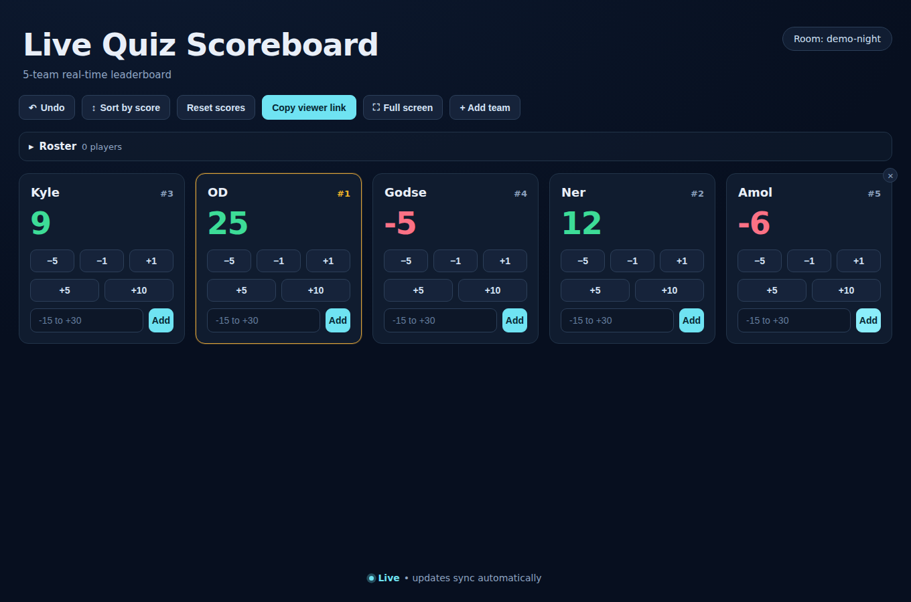

# Quizzards

**Live Quiz Scoreboard** — a real-time, multi-team leaderboard for running a quiz night.

Open a board, put it on the big screen, and adjust scores as the night runs. Anyone with the
viewer link sees every change instantly, on any device.



## What it does

- **Live scores.** Quick `−5 / −1 / +1 / +5 / +10` buttons on every team card, plus a custom
  adjustment for anything else in range. Changes reach every connected screen over websockets.
- **Standings.** Teams are ranked as you go, with competition ranking — tied teams share a place,
  so an all-square board shows everyone at `#1`. The leader's card is highlighted.
- **A roster.** Paste a list of names, then assign each person to a team from a dropdown, or let
  **Auto-assign** spread them evenly. Team members show as chips on their team's card.
- **Undo.** Every score change, rename, reset and roster edit can be walked back — from the button
  or <kbd>Ctrl</kbd>/<kbd>Cmd</kbd>+<kbd>Z</kbd>. Undo is shared, so it works from any host device.
- **Editable everywhere.** Board title, subtitle and team names are click-to-edit.
- **Viewer links.** *Copy viewer link* produces a read-only URL for the projector or the audience —
  it has no controls and can't change anything.
- **Full screen**, for the big screen at the front of the room.
- **Survives a restart.** Rooms are mirrored to disk, so a server hiccup doesn't lose the scores.

## Running it on your Windows PC

### First time — do this once

1. Go to **[setup.bat](https://github.com/KFish2501/Quizzards/raw/main/setup.bat)** and save the file
   (your browser may warn about a `.bat` file — keep it).
2. **Double-click `setup.bat`.** Click **Yes** to any Windows permission pop-up.

That's it. It installs what's needed, downloads the scoreboard, puts a **Quizzards** shortcut on
your Desktop, and starts it.

### Every time after that

**Double-click the Quizzards shortcut on your Desktop.**

A black window opens and shows you this:

```
==============================================================
   QUIZZARDS IS RUNNING
==============================================================

   YOU (this PC):     http://localhost:4000
   PLAYERS anywhere:  https://brave-quiz-night.trycloudflare.com
   Players on wifi:   http://192.168.1.42:4000

   The players' link is copied — just paste it to them.

   HOST PASSWORD:     kvv7rq3mza
   Keep this to yourself. It is what lets you change scores.

   Leave this window open. Closing it stops the quiz.
   Updates install themselves while you run.
==============================================================
```

Your browser opens automatically. Send the **players anywhere** link to whoever you like — it works
over the internet, so people don't have to be in the building. It's already on your clipboard, so
just paste it into WhatsApp or wherever.

**Leave the black window open** for the whole quiz. Closing it stops everything. Scores are saved,
so if it does get closed, opening it again picks up where you left off.

### Who can do what

| | Sees live scores | Changes scores |
| --- | :---: | :---: |
| **You** (the host, with the password) | yes | yes |
| **Everyone else** with the link | yes | no |

Anyone with the link watches the board update live and can do nothing else — the buttons aren't
just hidden, the server refuses the change. To take charge from another device (a second laptop,
or your phone), open the link, click **Take control**, and enter the host password from the black
window. That browser stays in control from then on.

The password is made for you the first time you run it and doesn't change. It lives in
`.quizzards\host-password.txt` inside the Quizzards folder if you forget it. To pick your own, put
it in `START.bat` next to `QUIZZARDS_HOST_PASSWORD=`.

### The public link, in detail

The internet link is a [Cloudflare quick tunnel](https://developers.cloudflare.com/cloudflare-one/connections/connect-networks/do-more-with-tunnels/trycloudflare/).
It needs no account and changes nothing on your router. Two things to know:

- **The address changes every time you start.** Send the fresh link each quiz night. A stable
  address needs a free Cloudflare account and a named tunnel — ask and it can be set up.
- **Your PC is still the host.** If it sleeps or the window closes, the link stops working.

Set `QUIZZARDS_PUBLIC=0` in `START.bat` if you'd rather keep it to your own wifi.

### Updates happen by themselves

Every time you start it, and every couple of minutes while it runs, it fetches the latest version
and installs it. You don't have to do anything. If an update ever fails, it keeps running the
version you already have, so nothing breaks mid-quiz.

### If something goes wrong

| What you see | What to do |
| --- | --- |
| Players can't open the wifi link | Windows Firewall — click **Allow** when it asks about Node.js. If you missed it, restart the PC and try again. (The internet link is unaffected by this.) |
| No internet link appeared | It falls back to the wifi link and says so. Usually a blocked network; try again, or use the wifi link. |
| You can't change scores | Click **Take control** and enter the host password from the black window. |
| "Node.js isn't installed" | Run `setup.bat` again. |
| The window closed by itself | Just open the Desktop shortcut again. Your scores are saved. |
| Something else | Screenshot the black window and send it on. |

### Settings

You almost certainly don't need these. To change one, right-click `START.bat` in the Quizzards
folder, pick **Edit**, and change the number near the top.

| Setting | Default | Meaning |
| --- | --- | --- |
| `QUIZZARDS_PUBLIC` | `1` | Set to `0` for a wifi-only board with no internet link |
| `QUIZZARDS_HOST_PASSWORD` | generated | Your own host password, if you don't want the generated one |
| `PORT` | `4000` | Port the scoreboard is served on |
| `QUIZZARDS_AUTOUPDATE` | `1` | Set to `0` to stop updates while it runs |
| `QUIZZARDS_UPDATE_INTERVAL` | `120` | Seconds between update checks |
| `QUIZZARDS_OPEN_BROWSER` | `1` | Set to `0` to not open a browser on startup |

## Developing

```bash
npm install
npm run dev
```

Then open <http://localhost:5173>, pick a room code, and hit **Host a board**.

For a production-style run (one process serving API and UI on port 4000):

```bash
npm run build
npm start
```

## How a quiz night runs

1. **Host a board** from the landing page — pick a code like `quiz-night` and a team count.
2. Open the **Roster**, paste your list of names, and hit **Auto-assign** (or set teams by hand).
3. Rename teams by clicking their names.
4. **Copy viewer link** and open it on the projector, or send it to the players.
5. Score each round with the quick buttons. Got it wrong? **Undo**.
6. **Sort by score** when you want the cards to reorder into standings.

Reopening the same room code later keeps the board exactly as you left it. The device that created
the board holds the host token (in `localStorage`); every other device gets the read-only view.

## Layout

| Package | What lives there |
| --- | --- |
| `packages/shared` | Types, the board reducer, ranking, roster parsing — the rules, with no I/O |
| `packages/server` | Express + Socket.IO, room ownership, undo history, disk persistence |
| `packages/client` | React + Vite UI: landing page, host board, read-only viewer |

The server is authoritative. Clients send *intents* (`adjust`, `assignPlayer`, …) and re-render only
when the server echoes new state back, so two hosts on two devices can drive the same board without
drifting apart.

## Scripts

| Command | What it does |
| --- | --- |
| `setup.bat` | One-time Windows setup: installs prerequisites, clones, makes a shortcut |
| `START.bat` | Host on Windows: update, build, serve, and keep updating |
| `npm run host` | The same supervisor `START.bat` uses, on any platform |
| `npm run dev` | Server on `:4000`, Vite dev server on `:5173` with API/websocket proxy |
| `npm run build` | Type-check and build all three packages |
| `npm start` | Run the built server, which also serves the built client |
| `npm test` | Run the test suite |
| `npm run typecheck` | Type-check without emitting |

## Configuration

| Variable | Default | Purpose |
| --- | --- | --- |
| `PORT` | `4000` | Server port |
| `QUIZZARDS_DATA` | `data/rooms.json` | Where room snapshots are written |
| `CORS_ORIGIN` | any | Restrict the origins allowed to connect |
| `VITE_SERVER_URL` | `http://localhost:4000` | Where the dev server proxies API traffic |

## Tests

```bash
npm test
```

Covers ranking and tie handling, delta validation, the full board reducer, roster parsing and
even distribution, and the server's room ownership and undo behaviour.
